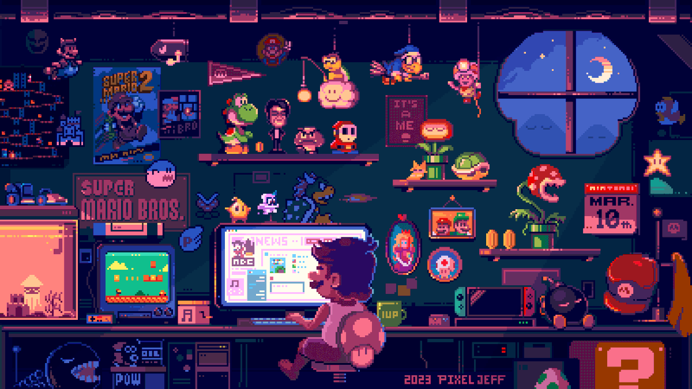

<h1 align="left">Hi 👋! My name is Aftab Shaik.</h1>

###

An impassioned full stack developer from India, dedicated to crafting seamless digital solutions. Constantly innovating and refining my skills to deliver impactful experiences that transcend boundaries.

###

 

###

  
  
  
  
  
  
  
  
  
  
  
  
  
  
  
  
  
  
  
  
  
  
  
  
  
  
  
  
  
  
  
  
  
  
  
  
  
  
  
  
  
  
  
  
  
  
  
  
  
  
  

###

  
  
  
  
  

###

 

###

  
  
  
  
  

###
